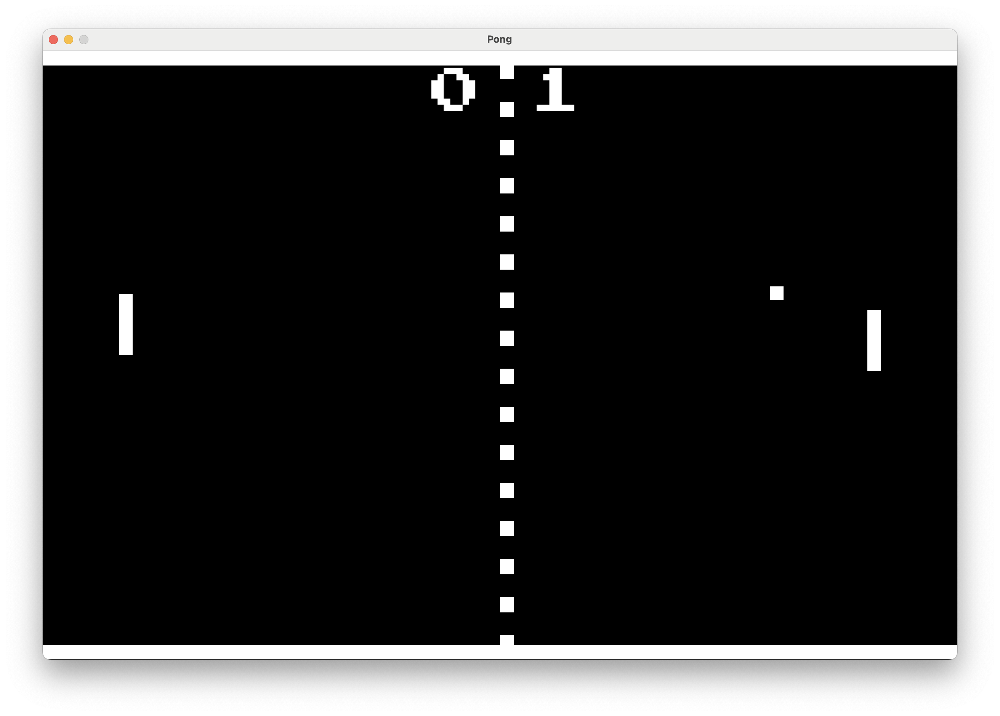

# ebitenpong

A simple single-player Pong implementation in [Ebitengine](https://ebitengine.org/) to demonstrate the basic features
and simplicity of the library.
Use `W` to go up, `S` to go down, `F1` to reset, and `ESC` to quit.
